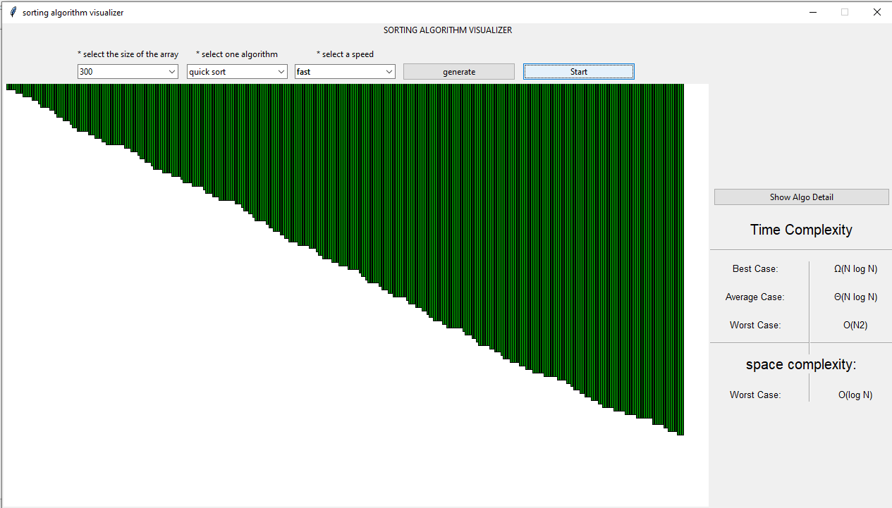

 

## Features
- User can select the size of the array, and specifiy the speed.
- User can analyse the algorithms.
- Different colors are used to visualize the algorithms, eg: green is for sorted part of the array

## Demo

